<div align="center">



</div>


---

<div align="center">

<table border="0" cellpadding="0" cellspacing="0">
<tr>
<td align="center" width="900">
<br/>
<p>


</p>
</td>
</tr>
</table>

</div>

<br/>


<br/>

## 〔 The Ghost of the Backend 〕

<p align="left">
<i>I do not chase glory. I build the systems that make it possible.</i>
</p>

Striving for precision in every line of code. I build **secure backend systems**, shape **clean REST APIs**, and architect digital foundations designed to scale — with **Java, Spring Boot, Node.js, Express.js, Rust, PostgreSQL, and MongoDB**.

Currently a **2nd-year Computer Science undergraduate** and a practicing backend developer who believes that the strength of a system lies not in its features, but in the **discipline of its design**.

<br/>

```yaml
# ── PROFILE ──────────────────────────────────────────────────────────
identity:
  name:       Senvidu
  role:       Backend API Specialist
  status:     2nd Year CS Undergraduate · Backend Developer Intern
  creed:      "Clean architecture. Secure systems. Silent excellence."

focus:
  - REST API Design & Implementation
  - Authentication & Authorization (JWT, OAuth2)
  - Database Modeling & Query Design
  - Clean Layered Architecture
  - Production-Ready Backend Systems

currently_mastering:
  - Spring Boot (service layer, JPA, security)
  - Rust (Axum + SeaORM async backend)
  - System design patterns for scalable APIs
# ────────────────────────────────────────────────────────────────────
```

<br/>


---

## ⚔️ The Six Combat Stances — Skills of the Ghost

*Each discipline is a blade. Each blade has its purpose.*

<br/>

<table border="0" width="100%">
<tr>
<td valign="top" width="50%">

### 🪨 Stone Stance — Core Backend
The foundation. Unyielding. Precise.

<p>


</p>

</td>
<td valign="top" width="50%">

### 💧 Water Stance — Databases
Shape and flow. Data finds its path.

<p>


</p>

</td>
</tr>
<tr>
<td valign="top">

### 🌬️ Wind Stance — Architecture & Code Flow
Structure in motion. Systems that breathe.

<p>


</p>

</td>
<td valign="top">

### 👻 Ghost Tools — Security & Auth
Invisible to attackers. Impossible to breach.

<p>


</p>

</td>
</tr>
<tr>
<td valign="top">

### 🔧 Forge Tools — Development Workflow
A craftsman's discipline. No shortcuts.

<p>


</p>

</td>
<td valign="top">

### 🦀 Iron Path — Rust & Systems
The hardest road. The sharpest edge.

<p>


</p>

</td>
</tr>
</table>

<br/>


<br/>

## 📜 Current Tales — Active Quests

*The battles being fought. The systems being forged.*

<br/>

<table border="0" width="100%" cellpadding="8">

<tr>
<td align="left" valign="top" width="50%"
    style="background:#1A1A1A; border-left: 3px solid #BC002D; padding: 12px;">

**⚔️ rcontact**
`ACTIVE QUEST`

> *A warrior's ledger, wrought in Rust.*

CLI contact management system built with pure Rust. Local-first, fast, reliable. The Iron Path in practice.

<p>


</p>

</td>
<td align="left" valign="top" width="50%"
    style="background:#1A1A1A; border-left: 3px solid #D4AF37; padding: 12px;">

**⚔️ Contact Management Service API**
`ACTIVE QUEST`

> *Steel-strong API, memory-safe by design.*

Full backend REST API in Rust using Axum and SeaORM, backed by PostgreSQL. Async architecture, clean service layers, production mindset.

<p>


</p>

</td>
</tr>

<tr>
<td align="left" valign="top" width="50%"
    style="background:#1A1A1A; border-left: 3px solid #D4AF37; padding: 12px;">

**⚔️ Bookstore REST API**
`COMPLETED TALE`

> *Every endpoint, a well-placed strike.*

JAX-RS Java backend implementing full CRUD for a bookstore system. Clean resource design, proper HTTP semantics, structured layers.

<p>


</p>

</td>
<td align="left" valign="top" width="50%"
    style="background:#1A1A1A; border-left: 3px solid #BC002D; padding: 12px;">

**⚔️ Spring Boot POS / Inventory System**
`IN PROGRESS`

> *A merchant's empire, governed by clean code.*

Full backend with Spring Boot — layered architecture (handlers → services → repositories → entities), database modeling, Spring Security integration.

<p>


</p>

</td>
</tr>

<tr>
<td align="left" valign="top" width="50%"
    style="background:#1A1A1A; border-left: 3px solid #D4AF37; padding: 12px;">

**⚔️ MERN Backend APIs**
`COMPLETED TALE`

> *The Node path. The Express blade.*

RESTful backend APIs built with Node.js and Express.js, MongoDB for persistence, JWT authentication, modular route architecture.

<p>


</p>

</td>
<td align="left" valign="top" width="50%" style="padding: 12px;">
<!-- Spacer cell -->
</td>
</tr>

</table>

<br/>


---

## 🏆 Honor Stats — The Scroll of Deeds

*Numbers do not define the warrior. But they do not lie either.*

<br/>

<div align="center">


&nbsp;&nbsp;


</div>

<br/>

<div align="center">


</div>

<br/>

<div align="center">


</div>

<br/>

<div align="center">


</div>

<br/>


<br/>

## 🏮 Charms — The Ghost's Connections

*Paths to find the warrior beyond the code.*

<br/>

<div align="center">

<a href="https://www.linkedin.com/in/chanithusenvidu" target="_blank">
  
</a>
&nbsp;
<a href="https://chanithu-senvidu.netlify.app/" target="_blank">
  
</a>
&nbsp;
<a href="https://github.com/Senvidu" target="_blank">
  
</a>

</div>

<br/>


---

## 📋 For the Recruiter — Plainly Spoken

<br/>

<div align="center">

```
┌─────────────────────────────────────────────────────────────────────┐
│                                                                     │
│   I specialize in designing and building backend APIs with          │
│   clean architecture, secure authentication, strong database        │
│   modeling, and production-focused development practices.           │
│                                                                     │
│   Stack:  Java · Spring Boot · Node.js · Express.js                 │
│           Rust · PostgreSQL · MongoDB                               │
│                                                                     │
│   Auth:   JWT · OAuth2 · RBAC                                       │
│   Tools:  Docker · GitHub Actions · Postman · Jest                  │
│   Style:  Layered architecture · Repository pattern · Clean code    │
│                                                                     │
│   Open to backend engineering roles and internships.                │
│                                                                     │
└─────────────────────────────────────────────────────────────────────┘
```

</div>

<br/>


<br/>

<div align="center">


<br/><br/>

```
  ── The Ghost leaves no trace. Only working systems. ──
```

<br/>

*© Senvidu — Backend Architect · Code Samurai · Ghost of the API Layer*

</div>
