<div align="center">



</div>


<br/>

<div align="center">


</div>

<br/>


<br/>

## 〔 Ghost of the Backend 〕

<p align="left"><i>I do not chase glory. I build the systems that make it possible.</i></p>

Striving for precision in every line of code. I build **secure backend systems**, shape **clean REST APIs**, and architect digital foundations designed to endure — with **Java, Spring Boot, Node.js, Express.js, Rust, PostgreSQL, and MongoDB**.

Currently a **2nd-year Computer Science undergraduate** and a practicing backend developer who believes the strength of a system lies not in its complexity, but in the **discipline of its design**.

<br/>

```yaml
# ── PROFILE ──────────────────────────────────────────────────────────
identity:
  name:        Senvidu
  role:        Backend API Specialist
  status:      2nd Year CS Undergraduate · Backend Developer Intern
  creed:       "Clean architecture. Secure systems. Silent excellence."

focus:
  - REST API Design & Clean Architecture
  - Authentication & Authorization (JWT, OAuth2)
  - Database Modeling (PostgreSQL · MongoDB)
  - Production-Ready Backend Systems
  - Cloud Deployment (GCP · Docker · CI/CD)

currently_mastering:
  - Spring Boot (JPA · Security · Service Layer)
  - Rust (Axum · SeaORM · Async Backend)
  - GCP Cloud Run & Cloud Build deployments
# ────────────────────────────────────────────────────────────────────
```

<br/>


---

## ⚔️ The Eight Combat Stances

*Each discipline is a blade. Each blade has its purpose.*

<br/>

<table border="0" width="100%">
<tr>
<td valign="top" width="50%">

### 🪨 Stone Stance — Backend Core
*The foundation. Unyielding. Precise.*

<p>


</p>

</td>
<td valign="top" width="50%">

### 💧 Water Stance — Databases
*Shape and flow. Data finds its path.*

<p>


</p>

</td>
</tr>
<tr>
<td valign="top">

### 👻 Ghost Blade — Auth & Security
*Invisible to attackers. Impossible to breach.*

<p>


</p>

</td>
<td valign="top">

### ☁️ Heaven's Cloud — GCP & Deployment
*Command the sky. Deploy with discipline.*

<p>


</p>

</td>
</tr>
<tr>
<td valign="top">

### 🦀 Iron Path — Rust & Systems
*The hardest road. The sharpest edge.*

<p>


</p>

</td>
<td valign="top">

### 🔧 Forge Tools — DevOps & Workflow
*A craftsman's discipline. No shortcuts.*

<p>


</p>

</td>
</tr>
<tr>
<td valign="top">

### 🌿 Wind Stance — Frontend Basics
*Light as wind. Knows the other side of the wall.*

<p>


</p>

</td>
<td valign="top">

### 📜 Scholar's Path — Software Engineering
*The way is forged by study, not by chance.*

<p>


</p>

</td>
</tr>
</table>

<br/>


<br/>

## 📜 Current Tales — Active Quests

*The battles being fought. The systems being forged.*

<br/>

<table border="0" width="100%" cellspacing="0">
<tr>
<td valign="top" width="50%" style="padding:12px; border-left:3px solid #BC0020;">

**⚔️ rcontact** &nbsp;`ACTIVE QUEST`

> *A warrior's ledger, wrought in Rust.*

CLI contact management system built with pure Rust. Local-first, fast, and reliable. The Iron Path in daily practice.

<p>


</p>

</td>
<td valign="top" width="50%" style="padding:12px; border-left:3px solid #EDEAE3;">

**⚔️ Contact Management Service API** &nbsp;`ACTIVE QUEST`

> *Steel-strong API, memory-safe by design.*

Full REST backend in Rust — Axum + SeaORM + PostgreSQL. Async architecture, clean service layers, production mindset.

<p>


</p>

</td>
</tr>
<tr>
<td valign="top" width="50%" style="padding:12px; border-left:3px solid #EDEAE3;">

**⚔️ Bookstore REST API** &nbsp;`COMPLETED TALE`

> *Every endpoint, a well-placed strike.*

Java JAX-RS backend — full CRUD, clean resource design, proper HTTP semantics, structured layers.

<p>


</p>

</td>
<td valign="top" width="50%" style="padding:12px; border-left:3px solid #BC0020;">

**⚔️ Spring Boot POS / Inventory System** &nbsp;`IN PROGRESS`

> *A merchant's empire, governed by clean code.*

Spring Boot backend — handlers → services → repositories → entities. Spring Security, JPA, database modeling.

<p>


</p>

</td>
</tr>
<tr>
<td valign="top" width="50%" style="padding:12px; border-left:3px solid #EDEAE3;">

**⚔️ MERN Backend APIs** &nbsp;`COMPLETED TALE`

> *The Node path. The Express blade.*

RESTful APIs with Node.js + Express.js + MongoDB. JWT authentication, modular route architecture.

<p>


</p>

</td>
<td valign="top" width="50%" style="padding:12px;">
</td>
</tr>
</table>

<br/>


---

## 🏆 Honor Stats — The Scroll of Deeds

<br/>

<div align="center">


</div>

<br/>

<div align="center">


</div>

<br/>

<div align="center">


</div>

<br/>

<div align="center">


</div>

<br/>


<br/>

## 🏮 Charms — Paths to the Ghost

<br/>

<div align="center">

<a href="https://www.linkedin.com/in/chanithusenvidu" target="_blank">

</a>
&nbsp;
<a href="https://chanithu-senvidu.netlify.app/" target="_blank">

</a>
&nbsp;
<a href="https://github.com/Senvidu" target="_blank">

</a>

</div>

<br/>


---

## 📋 For the Recruiter

<br/>

<div align="center">

```
┌─────────────────────────────────────────────────────────────────────────┐
│                                                                         │
│   I specialize in designing and building backend APIs with clean        │
│   architecture, secure authentication, strong database modeling,        │
│   and production-focused development practices.                         │
│                                                                         │
│   Backend:   Java · Spring Boot · Node.js · Express.js · Rust           │
│   Database:  PostgreSQL · MongoDB                                        │
│   Auth:      JWT · OAuth2 · RBAC                                        │
│   Cloud:     GCP · Cloud Run · Cloud Build · Docker · GitHub Actions    │
│   Pattern:   Layered Architecture · Repository · Service Layer          │
│                                                                         │
│   Open to backend engineering roles and internships.                    │
│                                                                         │
└─────────────────────────────────────────────────────────────────────────┘
```

</div>

<br/>


<br/>

<div align="center">


<br/><br/>

```
  ── The ghost leaves no trace. Only working systems. ──
```

<br/>

*© Senvidu — Ghost of the Backend · Backend API Specialist · 2nd Year CS*

</div>
